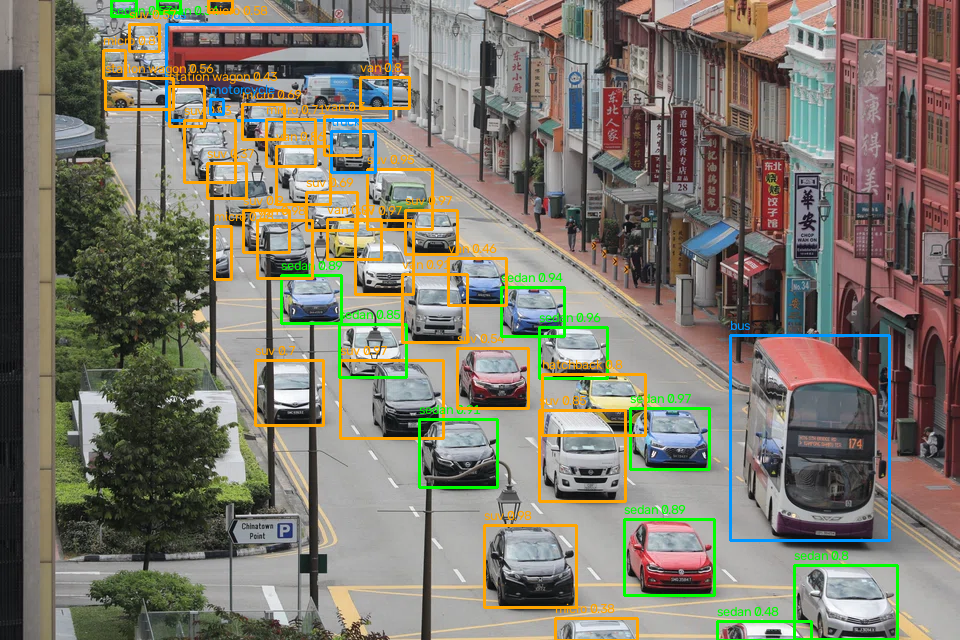

# Vehicle Detection Mini Hackathon

This project uses computer vision to detect vehicles in a street image, locates the buses, identifies the vehicle types, and estimates the number of sedan cars.

## Results

The final program detected:
1. Buses: 2 (one bus in the background near the top-left and one bus in the foreground on the right)
2. Vehicle types present: car, bus, truck, and motorcycle
3. Sedan cars: 11

### Vehicle counts

Vehicle type: Count

Car: 40  
Bus: 2  
Truck: 1  
Motorcycle: 1  
Bicycle: 0  

### Detected car body types

Body type: Count

SUV: 13  
Van: 7  
Station wagon: 2  
Micro: 6  
Sedan: 11  
Hatchback: 1  
Pickup: 0  

## Detection result

Green boxes show cars classified as sedans. Orange boxes show other passenger-car body types. Blue boxes show buses, trucks, and motorcycles.

## Installation

Python 3.12 was used for this project.

- Create a virtual environment: 
  `python -m venv .venv`

- Activate it on Windows Command Prompt: 
  `.venv\Scripts\activate`

- On macOS or Linux: 
  `source .venv/bin/activate`

- Install the required packages: 
  `pip install -r requirements.txt`

## Run

I tested three different detection methods. Each script can be run separately.

1. Basic YOLO detection: 
   `python src/detect1.py`

2. YOLO detection using SAHI: 
   `python src/sahi2.py`

3. Vehicle detection and sedan classification: 
   `python src/sedan3.py`

To generate the final result, run: 

`python src/sedan3.py`

The annotated image will be saved to: 

`runs/detect/sedan3/result.png`

The models are downloaded on the first run, so an internet connection is required.

## Method

1. I first tested YOLO11m on the whole image. It detected 32 cars but missed some small cars in the background.

2. Next, I used SAHI to divide the image into smaller overlapping sections. The number of detected cars increased from 32 to 40.

3. Finally, each detected car was cropped and classified using an EfficientNetV2-S car body classifier. The open-wheel category was excluded because there are no open-wheel racing cars in this street image.

## Models and tools

- Vehicle detection: Ultralytics YOLO11m
- Sliced inference: SAHI
- Body-type classification: [EfficientNetV2-S Car Body Classifier](https://huggingface.co/yigechundong/car-body-classifier)

## Limitations

Small or partly hidden vehicles may be missed. The model may confuse similar body types, such as sedans and hatchbacks. Therefore, the sedan count is an estimate and may not be exact.

## AI assistance

I used AI tools to find and compare possible computer vision methods and troubleshoot errors.